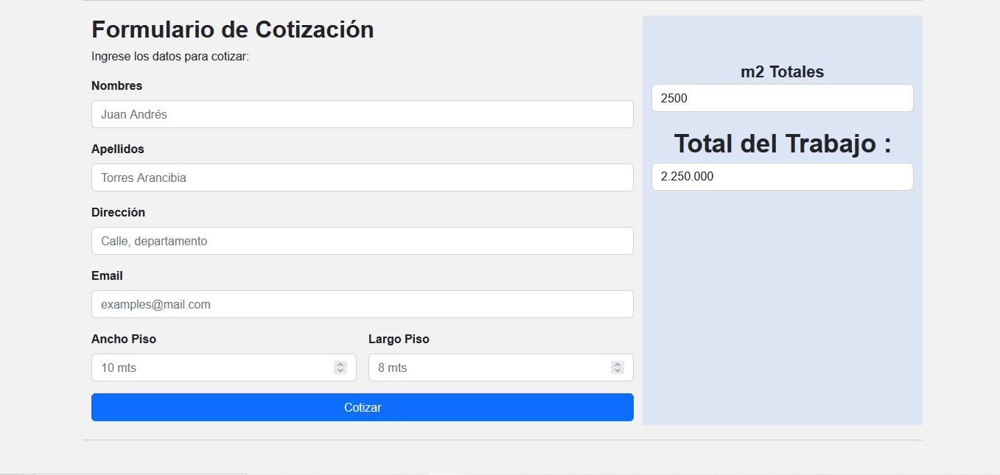

# Cotizador de Pisos

## Descripción

Este proyecto es una aplicación web que permite a los usuarios cotizar el costo de un piso basado en sus dimensiones. El usuario introduce el ancho y largo del piso, y el sistema calcula el área total en metros cuadrados, así como el costo correspondiente a un precio fijo de 900 por metro cuadrado.

## Funcionalidades

- **Ingreso de datos**: Los usuarios pueden ingresar su nombre, apellido, dirección, correo electrónico y las dimensiones del piso.
- **Cálculo automático**: El sistema realiza el cálculo del área y el costo total en función de las dimensiones ingresadas.
- **Validación de campos**: El cotizador verifica que todos los campos necesarios estén completos antes de realizar el cálculo.
- **Separador de miles**: Los resultados del área y del precio final se muestran con separadores de miles para mejorar la legibilidad.
- **Limpieza automática**: Una vez realizada la cotización, los campos del formulario se limpian automáticamente para permitir una nueva cotización sin necesidad de recargar la página.

## Imagen del Formulario

## Tecnologías utilizadas

- **HTML5**: Estructura del formulario y la página.
- **CSS3**: Estilos y diseño de la interfaz.
- **JavaScript**: Lógica del cotizador y manipulación de DOM.

